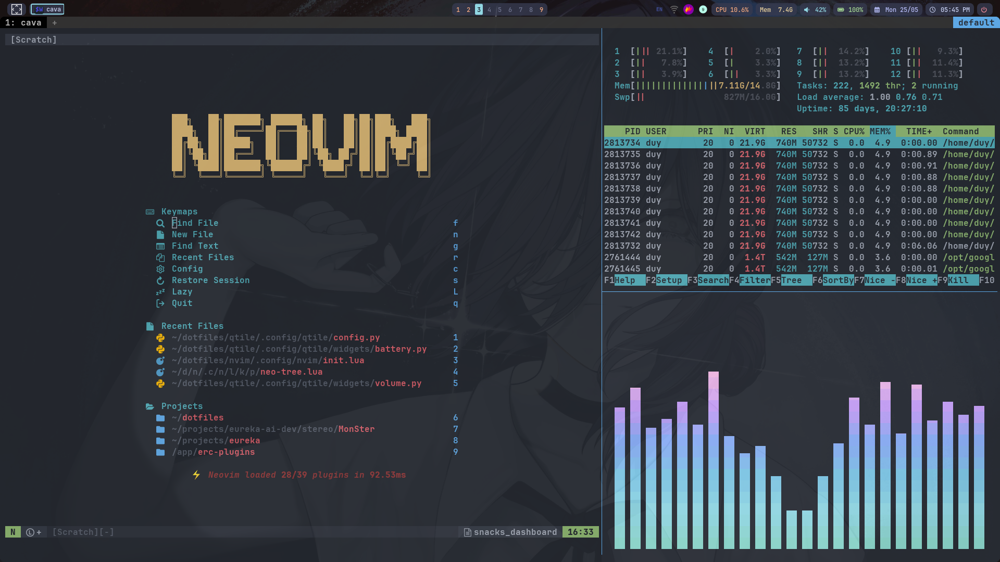

# dotfiles

My personal dotfiles

## Installation

On a fresh machine, run these steps in order.

1. Install [uv](https://docs.astral.sh/uv/) (follow upstream instructions).

2. Install system prerequisites:
   ```bash
   sudo apt update
   sudo apt install -y stow zsh
   ```

3. Install `invoke` (provides the `inv` task runner used below):
   ```bash
   uv tool install invoke
   ```
   Open a new shell so `~/.local/bin` is on `PATH`, then verify with `which inv`.

4. Install [oh-my-zsh](https://ohmyz.sh), then remove the default `.zshrc` it
   writes so stow can place this repo's version:
   ```bash
   rm ~/.zshrc
   ```

5. Install the Powerlevel10k theme and the zsh plugins referenced by `.zshrc`:
   ```bash
   ZSH_CUSTOM="${ZSH_CUSTOM:-$HOME/.oh-my-zsh/custom}"
   git clone --depth=1 https://github.com/romkatv/powerlevel10k.git "$ZSH_CUSTOM/themes/powerlevel10k"
   git clone https://github.com/zsh-users/zsh-autosuggestions       "$ZSH_CUSTOM/plugins/zsh-autosuggestions"
   git clone https://github.com/zsh-users/zsh-syntax-highlighting   "$ZSH_CUSTOM/plugins/zsh-syntax-highlighting"
   git clone https://github.com/Aloxaf/fzf-tab                      "$ZSH_CUSTOM/plugins/fzf-tab"
   ```

6. Clone this repo to `~/dotfiles` and symlink everything into `$HOME`:
   ```bash
   git clone https://github.com/duylp/dotfiles.git ~/dotfiles
   cd ~/dotfiles
   inv link-all
   ```
   To undo: `inv delete-all`.

7. Create an empty stub for the work-specific file `.zshrc` sources:
   ```bash
   touch ~/.zsh_eureka
   ```

8. Install the runtime tools `.zshrc` expects on startup:
   ```bash
   # zoxide — install via upstream instructions:
   # https://github.com/ajeetdsouza/zoxide#installation

   # fzf — install from upstream; the apt version is too old for `fzf --zsh`.
   git clone --depth 1 https://github.com/junegunn/fzf.git ~/.fzf
   ~/.fzf/install --bin
   mkdir -p ~/.local/bin
   ln -s ~/.fzf/bin/fzf ~/.local/bin/fzf
   ```

9. Install JetBrains Mono Nerd Font (for Powerlevel10k glyphs in the
   terminal). Download the zip from <https://www.nerdfonts.com/font-downloads>,
   then:
   ```bash
   mkdir -p ~/.local/share/fonts
   unzip -o ~/Downloads/JetBrainsMono.zip -d ~/.local/share/fonts/JetBrainsMonoNerdFont
   fc-cache -fv
   ```
   Verify with `fc-list | grep -i "jetbrains.*nerd"`.

10. Make zsh your login shell and re-login:
    ```bash
    chsh -s "$(which zsh)"
    ```

### Optional: terminal

```bash
sudo apt install -y ripgrep        # used by FZF_DEFAULT_COMMAND
sudo apt install -y wezterm        # or follow https://wezterm.org/install/linux.html
```

### Optional: neovim

The shipped config is a kickstart.nvim derivative with telescope, mason-managed
LSPs, treesitter, codecompanion, and an npm-installed `mcp-hub`. Apt's neovim is
too old; install the upstream binary.

1. Install neovim from upstream:
   ```bash
   curl -LO https://github.com/neovim/neovim/releases/latest/download/nvim-linux-x86_64.tar.gz
   sudo rm -rf /opt/nvim
   sudo tar -C /opt -xzf nvim-linux-x86_64.tar.gz
   sudo ln -sf /opt/nvim-linux-x86_64/bin/nvim /usr/local/bin/nvim
   rm nvim-linux-x86_64.tar.gz
   ```

2. System build/runtime deps:
   ```bash
   sudo apt install -y build-essential unzip xclip fd-find \
     python3-pip python3.12-venv
   ```
   - `build-essential` (gcc/make) — treesitter parsers and telescope-fzf-native
     compile from source.
   - `xclip` — system clipboard integration (X11; under Wayland use
     `wl-clipboard` instead).
   - `python3-pip` + `python3.12-venv` — Mason creates a venv per Python-based
     tool (e.g. `ruff`).

3. Add an `fd` symlink (Ubuntu installs it as `fdfind`):
   ```bash
   mkdir -p ~/.local/bin && ln -sf "$(which fdfind)" ~/.local/bin/fd
   ```

4. Install Node.js via nvm (needed by `mcp-hub` and several Mason-managed LSPs):
   ```bash
   curl -o- https://raw.githubusercontent.com/nvm-sh/nvm/v0.39.7/install.sh | bash
   # open a new shell so nvm loads
   nvm install --lts
   ```

5. First launch — `lazy.nvim` bootstraps plugins, treesitter compiles parsers,
   and Mason installs LSPs:
   ```bash
   nvim
   ```
   Run `:checkhealth` once it settles to spot any leftover gaps.

### Optional: qtile window manager

1. Install qtile via uv with the deps the config and built-in widgets need:
   ```bash
   uv tool install qtile \
     --with catppuccin \
     --with pulsectl-asyncio \
     --with psutil \
     --with dbus-next
   ```
   Build deps for `xcffib`/`cairocffi` (if uv builds them from source):
   ```bash
   sudo apt install -y python3-dev libxcb-render0-dev libxcb-shape0-dev \
     libxcb-xfixes0-dev libxcb-cursor-dev libffi-dev libcairo2-dev \
     libpangocairo-1.0-0
   ```

2. Install the apps qtile spawns from keybindings, autostart, and rofi scripts:
   ```bash
   sudo apt install -y \
     picom dunst rofi flameshot pass cava \
     network-manager-gnome ibus pulseaudio-utils xinput
   # autorandr is optional; only needed for multi-display profile switching.
   ```

3. Validate the config:
   ```bash
   qtile check -c ~/.config/qtile/config.py
   ```

4. Register qtile as an X session so the login screen shows it:
   ```bash
   sudo tee /usr/share/xsessions/qtile.desktop >/dev/null <<EOF
   [Desktop Entry]
   Name=Qtile
   Comment=Qtile session
   Exec=$(which qtile) start
   Type=Application
   Keywords=wm;tiling
   EOF
   ```

5. Log out, pick **Qtile** from the session selector, and log back in.

## Screenshots


