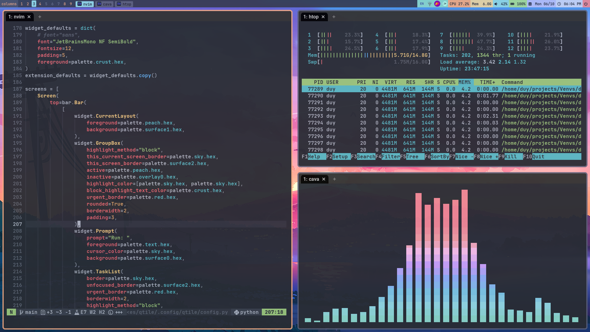

# dotfiles

My personal dotfiles

## Usage

Clone this repository to your home directory
```bash
git clone https://github.com/duylp/dotfiles.git
```

Link the dotfiles to your home directory
```bash
inv link-all
```

## Screenshots



